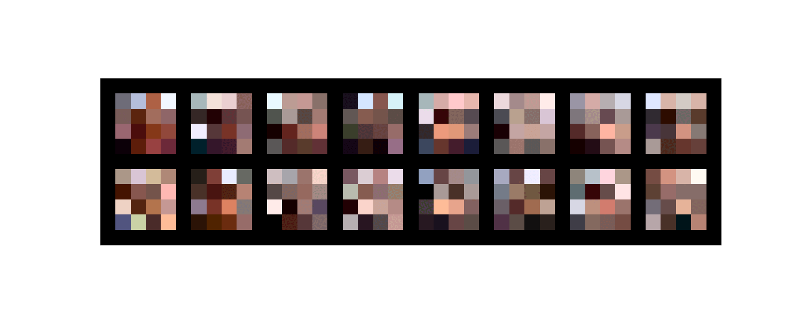

# ImageGeneration

This is an implementaiton of the **PGGAN** in Pytorch i made my self trained on the **CELEBA** dataset.  
It was quite funny to learn about some concepts of advanced GANS like:
* Progressively increase the resolution of the net during training.
* Wasserstein loss and the advantages with respect to the cross entropy version. The paper of such loss function is really intersting

The results are not as good as I was expecting, mainly due to the time and computational resources needed to train a PGGAN. At least, to reporduce the results of the paper which use 800k images for each resolution used (4x4 -> 8x8 -> 16x16 ...). I needed to cut off these numbers a lot, to obtain a least a result at 64x64 resolution (which was not the objective as i wanted to get to 256x256).  
BUT I would like to discover more about:
* the loss, as it seems to change with really high frequency. I saw sometimes on the internet that if some batches show high gradients in the computation are just discarded. Maybe it will be usefull at least to slow down the learning rate as now it is at 1E-3 with Adam (as in the paper). Not sure if it is sufficient for the scope
* other models, maybe going to more advanced GANS but the computational times are quite high with respect to other projects

Here are the results

 

 Those faces are ugly as fck :P
